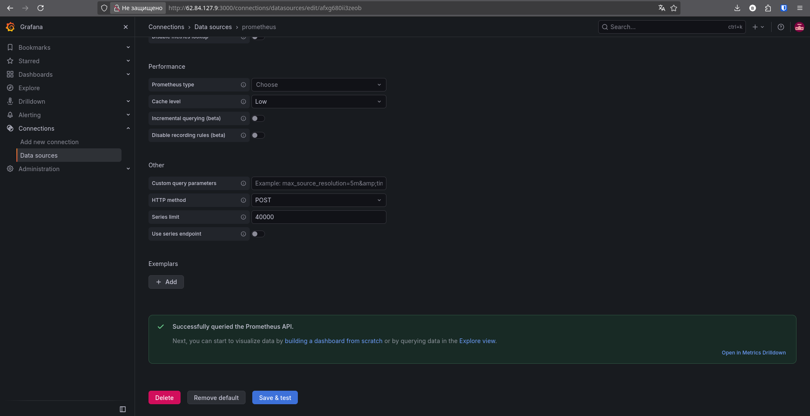

# Курсовая работа на профессии "DevOps-инженер с нуля" — Борисенко Даниил

## Задача

В рамках курсовой работы развернул в Yandex Cloud отказоустойчивую инфраструктуру для сайта.

Нужно было настроить:

- два web-сервера в разных зонах доступности;
- Application Load Balancer;
- мониторинг через Prometheus и Grafana;
- сбор логов через Filebeat, Elasticsearch и Kibana;
- приватные и публичные подсети;
- Security Groups;
- bastion host;
- ежедневное резервное копирование дисков.

Для создания облачной инфраструктуры использовал Terraform.

Для настройки виртуальных машин использовал Ansible.

Сервисы мониторинга и логирования запускаются в Docker.

---

# 1. Файлы проекта

Terraform:

```text
providers.tf
variables.tf
network.tf
vms.tf
balancer.tf
backup.tf
```

Ansible и SSH:

```text
ansible.cfg
hosts.ini
ssh_config
nginx.yml
docker.yml
```

Конфигурации сервисов:

```text
cloud-init.yml
docker-compose.yml
prometheus.yml
nginxlog.hcl
filebeat.yml
```

Скриншоты проверок находятся в каталоге:

```text
screenshots/
```

---

# 2. Terraform и Yandex Cloud

Для работы с Yandex Cloud подключил Terraform-провайдер:

```hcl
terraform {
  required_providers {
    yandex = {
      source = "yandex-cloud/yandex"
    }
  }
}

provider "yandex" {
  zone = "ru-central1-a"
}
```

В `variables.tf` используется переменная:

```hcl
variable "flow" {
  type    = string
  default = "project"
}
```

Она используется в именах создаваемых ресурсов.

Для Terraform создал отдельный service account.

Авторизация выполнялась через временный IAM-токен:

```bash
export YC_TOKEN=$(yc iam create-token --impersonate-service-account-id <SERVICE_ACCOUNT_ID>)
export YC_CLOUD_ID=$(yc config get cloud-id)
export YC_FOLDER_ID=$(yc config get folder-id)
```

Для проверки и применения конфигурации использовал:

```bash
terraform init
terraform validate
terraform plan
terraform apply
```

## Проблема с авторизацией

Во время работы несколько раз Terraform переставал обращаться к Yandex Cloud из-за истёкшего IAM-токена.

В этом случае повторно получал токен:

```bash
export YC_TOKEN=$(yc iam create-token --impersonate-service-account-id <SERVICE_ACCOUNT_ID>)
```

После этого Terraform снова нормально работал.

---

# 3. Сеть

Для проекта создал одну VPC.

В ней находятся две приватные подсети:

```text
develop_a — 10.0.1.0/24 — ru-central1-a
develop_b — 10.0.2.0/24 — ru-central1-b
```

И одна публичная:

```text
public — 10.0.3.0/24 — ru-central1-a
```

Две приватные подсети нужны для размещения web-серверов в разных зонах доступности.

`web-a` находится в:

```text
ru-central1-a
```

`web-b`:

```text
ru-central1-b
```

Web-серверы, Prometheus и Elasticsearch находятся в приватных подсетях и не имеют публичных IP.

Grafana, Kibana и bastion находятся в публичной подсети.

---

# 4. NAT Gateway

Приватным ВМ нужен исходящий доступ в интернет для установки пакетов и скачивания Docker-образов.

При этом выдавать им публичные IP я не стал.

Для выхода в интернет создал NAT Gateway и таблицу маршрутизации.

Маршрут:

```text
0.0.0.0/0
```

направляется через NAT Gateway.

В результате приватные машины могут обращаться во внешнюю сеть, но напрямую из интернета они недоступны.

---

# 5. Security Groups

Для разных сервисов создал отдельные Security Groups.

Старался открывать только необходимые порты.

На bastion из интернета открыт только:

```text
22/tcp
```

У web-серверов разрешены:

```text
22   — от bastion
80   — от Application Load Balancer
9100 — от Prometheus
4040 — от Prometheus
```

Prometheus принимает соединения на:

```text
9090
```

только от Grafana.

Grafana доступна по:

```text
3000
```

Kibana:

```text
5601
```

Elasticsearch находится в приватной сети.

Порт:

```text
9200
```

доступен только web-серверам с Filebeat и Kibana.

Таким образом наружу открыты только необходимые web-интерфейсы и SSH bastion.

---

# 6. Виртуальные машины

Все виртуальные машины создаются через Terraform.

Используется:

```text
Ubuntu 22.04 LTS
```

Созданы:

```text
bastion
web-a
web-b
prometheus
grafana
elasticsearch
kibana
```

`web-a` и `web-b` размещены в разных зонах доступности.

Prometheus и Elasticsearch не имеют публичных IP.

Grafana и Kibana имеют публичные адреса, потому что их web-интерфейсы должны быть доступны для проверки.

Elasticsearch выделил больше памяти и диск большего размера, так как он требовательнее остальных сервисов.

Так как инфраструктура учебная, использовал:

```hcl
core_fraction = 20
```

и прерываемые ВМ:

```hcl
scheduling_policy {
  preemptible = true
}
```

Это позволило уменьшить стоимость ресурсов в облаке.


---

# 7. Cloud-init

Для первоначальной настройки ВМ используется `cloud-init.yml`.

На каждой машине создаётся пользователь:

```text
user
```

с правами sudo.

Также добавляется мой публичный SSH-ключ.

После создания ВМ можно подключаться к ним по ключу без использования пароля.

---

# 8. Bastion и Ansible

Внутренние серверы не имеют публичных IP, поэтому напрямую подключаться к ним с ноутбука нельзя.

Для доступа используется bastion host.

На момент выполнения работы его публичный адрес:

```text
51.250.82.97
```

В `hosts.ini` оставил только группы серверов и их адреса:

```ini
[bastion]
51.250.82.97

[webservers]
10.0.1.10
10.0.2.20

[prometheus]
10.0.1.18

[grafana]
10.0.3.34

[elasticsearch]
10.0.1.7

[kibana]
10.0.3.11

[servers:children]
webservers
prometheus
grafana
elasticsearch
kibana
```

Сначала подключение через bastion было настроено прямо в inventory через длинный `ProxyCommand`.

Работало это нормально, но сам `hosts.ini` из-за этого стал плохо читаемым.

Поэтому SSH-логику вынес в отдельный файл:

```text
ssh_config
```

В нём указал параметры bastion:

```sshconfig
Host 51.250.82.97
    User user
    IdentityFile ~/.ssh/yandex_cloud
```

А внутренние адреса подключаются через него с помощью `ProxyJump`:

```sshconfig
Host 10.0.1.* 10.0.2.* 10.0.3.*
    User user
    IdentityFile ~/.ssh/yandex_cloud
    ProxyJump user@51.250.82.97
```

После этого `ansible.cfg` стал проще:

```ini
[defaults]
inventory = ./hosts.ini
host_key_checking = False

[ssh_connection]
ssh_args = -F ./ssh_config
```

Теперь:

- `hosts.ini` содержит только список серверов;
- `ssh_config` отвечает за SSH-подключение;
- `ansible.cfg` указывает Ansible использовать эти файлы.

При первой попытке после изменения bastion не подключался:

```text
daniil@51.250.82.97: Permission denied (publickey)
```

Причина была в том, что SSH-правило было написано для имени `bastion`, а Ansible подключался непосредственно по IP.

Из-за этого использовался локальный пользователь `daniil`.

После того как в `ssh_config` указал непосредственно IP bastion и пользователя `user`, подключение заработало.

Финальная проверка:

```bash
ansible all -m ping
```

Все серверы успешно отвечают.


Ansible также выводил предупреждение о автоматически найденном Python:

```text
/usr/bin/python3.10
```

Это предупреждение не мешало работе playbook.

---

# 9. Web-серверы

На двух web-серверах с помощью Ansible установил Nginx.

Для этого используется:

```text
nginx.yml
```

Playbook:

- устанавливает nginx;
- запускает сервис;
- включает автозапуск;
- размещает одинаковую статическую страницу.

Запуск:

```bash
ansible-playbook nginx.yml
```

После установки проверил Nginx сразу на двух серверах:

```bash
ansible webservers -m shell -a "curl -s localhost"
```

Оба сервера возвращают одинаковую HTML-страницу.

Это важно, так как оба используются как одинаковые backend для балансировщика.

---

# 10. Application Load Balancer

После настройки web-серверов создал Application Load Balancer.

В Terraform создаются:

```text
Target Group
Backend Group
HTTP Router
Virtual Host
Application Load Balancer
```

В Target Group добавлены:

```text
10.0.1.10
10.0.2.20
```

Это внутренние адреса `web-a` и `web-b`.

Backend работает на:

```text
80
```

Для web-серверов настроен HTTP healthcheck:

```text
path: /
port: 80
interval: 5s
timeout: 3s
```

Оба сервера успешно проходят проверку.


Application Load Balancer имеет публичный IP и listener на порту:

```text
80
```

Проверил сайт через терминал:

```bash
curl http://51.250.45.31
```


Также проверил его в браузере:


Web-серверы напрямую из интернета недоступны. Пользователь обращается только к балансировщику.

---

# 11. Docker

Для сервисов мониторинга и логирования решил использовать Docker.

Через Docker запускаются:

```text
Node Exporter
Nginx Log Exporter
Prometheus
Grafana
Elasticsearch
Kibana
Filebeat
```

Docker и Docker Compose устанавливаются через:

```text
docker.yml
```

Основной запуск:

```bash
ansible-playbook docker.yml
```

Docker выбрал потому, что для учебного проекта так проще разворачивать одинаковые версии сервисов и не устанавливать каждый сервис вручную.

---

# 12. Мониторинг

Для мониторинга использовал:

```text
Node Exporter
Nginx Log Exporter
Prometheus
Grafana
```

## Node Exporter

Node Exporter работает на обоих web-серверах.

Он доступен на:

```text
9100
```

Через него Prometheus получает системные метрики:

- CPU;
- RAM;
- filesystem;
- сеть;
- load;
- uptime.

## Nginx Log Exporter

Для HTTP-метрик использовал:

```text
prometheus-nginxlog-exporter
```

Он читает:

```text
/var/log/nginx/access.log
```

и отдаёт метрики на:

```text
4040
```

Настройки находятся в:

```text
nginxlog.hcl
```

---

# 13. Проблема с Nginx Log Exporter

С Nginx Log Exporter возникла основная проблема при настройке мониторинга.

После запуска Prometheus видел только два работающих target вместо четырёх.

Ожидалось:

```text
2 x Node Exporter
2 x Nginx Log Exporter
```

Проверил exporter отдельно.

Node Exporter отвечали:

```text
10.0.1.10:9100 — 200
10.0.2.20:9100 — 200
```

Nginx Log Exporter были недоступны.

После проверки:

```bash
docker ps -a
```

увидел, что оба контейнера находятся в:

```text
Restarting
```

В логах:

```bash
docker logs nginxlog-exporter
```

была ошибка:

```text
read /etc/prometheus-nginxlog-exporter.hcl: is a directory
```

Проблема оказалась в монтировании конфигурационного файла.

Вместо файла Docker использовал каталог.

После исправления конфигурации и пересоздания контейнеров exporter успешно запустился.

После этого Prometheus начал видеть все четыре endpoint.

---

# 14. Исправление Ansible playbook

При финальной проверке проекта нашёл ещё одну проблему.

В первой версии `docker.yml` Ansible запускал только:

```text
node-exporter
```

Nginx Log Exporter был запущен мной вручную во время отладки.

Из-за этого текущая инфраструктура работала, но playbook не мог полностью воспроизвести её с нуля.

Исправил запуск:

```yaml
command: docker compose up -d node-exporter nginxlog-exporter
```

После изменения снова выполнил:

```bash
ansible-playbook docker.yml
```

И проверил контейнеры:

```bash
ansible webservers -b -m shell -a "docker ps | grep -E 'node-exporter|nginxlog-exporter|filebeat'"
```

На обоих web-серверах работают:

```text
node-exporter
nginxlog-exporter
filebeat
```

После этого ручной запуск Nginx Log Exporter больше не требуется.

---

# 15. Prometheus

Prometheus находится на отдельной приватной ВМ:

```text
10.0.1.18
```

Публичного IP у неё нет.

В `prometheus.yml` настроен интервал:

```text
15 секунд
```

Prometheus получает системные метрики с:

```text
10.0.1.10:9100
10.0.2.20:9100
```

И метрики Nginx:

```text
10.0.1.10:4040
10.0.2.20:4040
```

Проверил работу контейнера:


---

# 16. Grafana

Grafana развернута на отдельной публичной ВМ.

Prometheus подключён как Data Source:

```text
http://10.0.1.18:9090
```

Соединение успешно прошло проверку.



Для системных показателей использовал готовый dashboard:

```text
Node Exporter Full
ID 1860
```

Он отображает:

- CPU;
- RAM;
- диски;
- сеть;
- system load;
- uptime;
- saturation.

На основных показателях используются thresholds.


Для Nginx использовал:

```text
NGINX Log Metrics
ID 15947
```

В нём отображаются HTTP-коды, HTTP-трафик и метрики:

```text
http_response_count_total
http_response_size_bytes
```


У части дополнительных панелей готового dashboard отображается:

```text
No data
```

Это связано с тем, что dashboard содержит дополнительные запросы, для которых используемый мной exporter не предоставляет данные.

Необходимые для задания метрики при этом работают.

---

# 17. Elasticsearch

Для хранения логов развернул Elasticsearch на отдельной приватной ВМ:

```text
10.0.1.7
```

Использовал официальный образ версии:

```text
8.15.3
```

Elasticsearch работает как:

```text
single-node
```

Для него через Ansible устанавливается:

```text
vm.max_map_count=262144
```

Для учебного проекта отключил:

```text
xpack.security.enabled=false
```

При этом Elasticsearch не имеет публичного IP.

Доступ к `9200` ограничен Security Group.

Проверил работу:

```bash
ansible elasticsearch -b -m shell -a "curl -s localhost:9200"
```

Elasticsearch вернул информацию о кластере и версии.


---

# 18. Filebeat

На обоих web-серверах работает Filebeat.

Он читает:

```text
/var/log/nginx/access.log
/var/log/nginx/error.log
```

и отправляет данные в Elasticsearch:

```text
http://10.0.1.7:9200
```

Каталог логов монтируется в контейнер только для чтения.

Проверил работу Filebeat на двух серверах:


---

# 19. Kibana

Kibana работает на отдельной публичной ВМ.

Она подключена к Elasticsearch по приватному адресу:

```text
http://10.0.1.7:9200
```

Web-интерфейс доступен на:

```text
5601
```


---

# 20. Проверка логирования

Для проверки решил сгенерировать реальные nginx-логи.

Создал несколько запросов к несуществующей странице:

```bash
for i in {1..10}; do
  curl -s -o /dev/null http://51.250.45.31/test404
done
```

Nginx отвечает:

```text
404
```

и записывает запросы в `access.log`.

Filebeat считывает эти записи и отправляет их в Elasticsearch.

В Kibana создал Data View:

```text
filebeat-*
```

В Discover выполнил поиск:

```text
test404
```

В результате появились записи:

```text
GET /test404 HTTP/1.1 404
```


Таким образом проверил работу всей цепочки:

```text
Nginx -> Filebeat -> Elasticsearch -> Kibana
```

---

# 21. Резервное копирование

Для всех виртуальных машин настроил автоматические snapshots дисков.

Расписание:

```text
0 0 * * *
```

То есть snapshot создаётся один раз в сутки.

Время хранения:

```text
168h
```

Это:

```text
7 дней
```

В расписание добавлены диски всех ВМ:

```text
web-a
web-b
prometheus
grafana
elasticsearch
kibana
bastion
```

После:

```bash
terraform apply
```

проверил расписание:

```bash
yc compute snapshot-schedule list
```

Создано:

```text
daily-backup-project
```

Статус:

```text
ACTIVE
```


---

# 22. Основные проблемы

В процессе работы столкнулся с несколькими проблемами.

## IAM-токен

IAM-токен Yandex Cloud истекал, после чего Terraform переставал проходить авторизацию.

Решение — повторно получать `YC_TOKEN`.

## Nginx Log Exporter

Контейнер постоянно перезапускался.

В логах была ошибка:

```text
read /etc/prometheus-nginxlog-exporter.hcl: is a directory
```

После исправления монтирования конфигурации exporter заработал.

## Ansible не запускал Nginx Log Exporter

Во время отладки exporter был запущен вручную.

Позже обнаружил, что в `docker.yml` отсутствовал его автоматический запуск.

Исправил playbook и повторно проверил оба web-сервера.

## SSH через bastion

Сначала подключение через bastion было записано длинным `ProxyCommand` прямо в `hosts.ini`.

Чтобы сделать конфигурацию понятнее, вынес SSH-настройки в отдельный `ssh_config` и использовал `ProxyJump`.

После первой правки Ansible пытался подключаться к bastion как:

```text
daniil@51.250.82.97
```

и получал:

```text
Permission denied (publickey)
```

Причина была в том, что SSH-настройка не применялась к IP bastion.

После указания IP и пользователя `user` напрямую в `ssh_config` подключение заработало.

## Grafana

Некоторые дополнительные панели импортированного Nginx dashboard показывают `No data`.

Необходимые для курсовой метрики при этом собираются и отображаются, поэтому полностью переделывать готовый dashboard не стал.

---

# 23. Принятые решения

Prometheus, Grafana, Elasticsearch, Kibana и exporters запускаются через Docker.

Для учебного проекта так проще устанавливать и повторно разворачивать сервисы через Ansible.

Elasticsearch работает как `single-node`.

Для production этого было бы недостаточно, но для этой работы отдельной ВМ достаточно.

Использовал прерываемые ВМ, чтобы уменьшить расходы на Yandex Cloud.

В качестве сайта использовал простую статическую HTML-страницу, потому что главная цель web-части — проверить работу Nginx, ALB, мониторинга и логирования.

Prometheus и Elasticsearch оставил в приватной сети.

---

# 24. Доступ к сервисам

Сайт:

```text
http://51.250.45.31
```

Grafana:

```text
http://62.84.127.9:3000
```

Kibana:

```text
http://93.77.182.150:5601
```

Prometheus и Elasticsearch публичных IP не имеют.

Так как используются прерываемые ВМ, публичные IP могут измениться после остановки или пересоздания ресурсов.

---

# Итог

В Yandex Cloud развернул инфраструктуру с двумя web-серверами Nginx в разных зонах доступности.

Оба web-сервера находятся в приватной сети.

Внешний трафик принимается Application Load Balancer и распределяется между двумя backend.

Оба сервера успешно проходят HTTP healthcheck.

Для мониторинга используются Node Exporter, Nginx Log Exporter, Prometheus и Grafana.

Prometheus получает системные и HTTP-метрики от обоих web-серверов.

Для централизованного сбора логов Filebeat читает `access.log` и `error.log` Nginx и отправляет их в Elasticsearch.

Логи доступны для просмотра через Kibana.

Доступ к внутренним серверам по SSH выполняется через bastion host с использованием `ProxyJump`.

Сетевой доступ между компонентами ограничен Security Groups.

Для дисков всех виртуальных машин настроено ежедневное создание snapshot с хранением в течение семи дней.

Инфраструктура создаётся через Terraform, а настройка серверов и запуск сервисов выполняются через Ansible.

Во время выполнения пришлось отдельно исправлять Nginx Log Exporter, Ansible playbook и настройку SSH через bastion.

После финальной проверки все основные компоненты работают, а конфигурация может быть повторно развернута без ручного запуска сервисов.

---

### Использованные источники

1. [Yandex Cloud Terraform](https://yandex.cloud/ru/docs/tutorials/infrastructure-management/terraform-quickstart)
2. [Yandex Cloud Application Load Balancer](https://yandex.cloud/ru/docs/application-load-balancer/)
3. [Yandex Cloud Целевые группы](https://yandex.cloud/ru/docs/application-load-balancer/concepts/target-group)
4. [Yandex Cloud Группы бэкендов](https://yandex.cloud/ru/docs/application-load-balancer/concepts/backend-group)
5. [Yandex Cloud Группы безопасности](https://yandex.cloud/ru/docs/vpc/concepts/security-groups)
6. [Terraform Registry Yandex Cloud Provider](https://registry.terraform.io/providers/yandex-cloud/yandex/latest/docs)
7. [Ansible Documentation](https://docs.ansible.com/)
8. [Docker Compose Documentation](https://docs.docker.com/compose/)
9. [Prometheus Documentation](https://prometheus.io/docs/)
10. [Prometheus Node Exporter](https://github.com/prometheus/node_exporter)
11. [Prometheus Nginx Log Exporter](https://github.com/martin-helmich/prometheus-nginxlog-exporter)
12. [Grafana Documentation](https://grafana.com/docs/grafana/latest/)
13. [Grafana Dashboard — Node Exporter Full, ID 1860](https://grafana.com/grafana/dashboards/1860-node-exporter-full/)
14. [Grafana Dashboard — NGINX Log Metrics, ID 15947](https://grafana.com/grafana/dashboards/15947-nginx-log-metrics-m/)
15. [Elasticsearch Documentation](https://www.elastic.co/docs)
16. [Filebeat Documentation](https://www.elastic.co/docs/reference/beats/filebeat)
17. [Kibana Documentation](https://www.elastic.co/docs/explore-analyze)
18. [Nginx Documentation](https://nginx.org/en/docs/)

---
