# Курсовая работа «DevOps-инженер с нуля»

## Задача

В рамках курсовой работы я развернул в Yandex Cloud инфраструктуру для сайта с балансировкой нагрузки, мониторингом, централизованным сбором логов и резервным копированием.

Для создания облачной инфраструктуры использовал Terraform, для настройки виртуальных машин — Ansible.

В результате были развернуты:

- две одинаковые ВМ с Nginx в разных зонах доступности;
- Application Load Balancer;
- Prometheus;
- Grafana;
- Node Exporter;
- Nginx Log Exporter;
- Elasticsearch;
- Kibana;
- Filebeat;
- bastion host;
- автоматическое резервное копирование дисков.

---

# 1. Структура проекта

```text
netology-project/
├── ansible/
│   ├── ansible.cfg
│   ├── docker-compose.yml
│   ├── docker_playbook.yml
│   ├── filebeat.yml
│   ├── hosts.ini
│   ├── nginx_playbook.yml
│   ├── nginxlog.hcl
│   └── prometheus.yml
│
├── terraform/
│   ├── backup.tf
│   ├── balancer.tf
│   ├── cloud-init.yml
│   ├── hosts.ini.tftpl
│   ├── inventory.tf
│   ├── network.tf
│   ├── outputs.tf
│   ├── providers.tf
│   ├── variables.tf
│   └── vms.tf
│
├── screenshots/
├── .gitignore
├── Задание.md
└── README.md
```

Файл `ansible/hosts.ini` создаётся Terraform автоматически и в Git не хранится.

Файлы состояния Terraform также исключены из репозитория.

---

# 2. Terraform

Для создания инфраструктуры использовал Terraform и провайдер Yandex Cloud.

Также подключён провайдер `local`, который нужен для автоматической генерации Ansible inventory.

Основные провайдеры:

```hcl
terraform {
  required_providers {
    yandex = {
      source = "yandex-cloud/yandex"
    }

    local = {
      source = "hashicorp/local"
    }
  }
}
```

Для авторизации использую временный IAM-токен:

```bash
export YC_TOKEN=$(yc iam create-token --impersonate-service-account-id <SERVICE_ACCOUNT_ID>)
export YC_CLOUD_ID=$(yc config get cloud-id)
export YC_FOLDER_ID=$(yc config get folder-id)
```

Публичный SSH-ключ передаю в Terraform через переменную окружения:

```bash
export TF_VAR_ssh_public_key="$(cat ~/.ssh/yandex_cloud.pub)"
```

Сам приватный ключ в репозиторий не добавляется.

---

# 3. Сеть

Для проекта создана одна VPC.

Используются три подсети:

```text
10.0.1.0/24 — приватная, ru-central1-a
10.0.2.0/24 — приватная, ru-central1-b
10.0.3.0/24 — публичная, ru-central1-a
```

В приватной сети находятся:

```text
web-a
web-b
prometheus
elasticsearch
```

Grafana и Kibana имеют публичные IP, так как их web-интерфейсы должны быть доступны для проверки.

Bastion также имеет публичный IP и используется для SSH-доступа к остальным серверам.

Для выхода приватных машин в интернет настроен NAT Gateway и таблица маршрутизации.

---

# 4. Группы безопасности

Для сервисов настроены Security Groups.

Снаружи открыты только необходимые порты.

Bastion:

```text
22/tcp — SSH
```

Web-серверы:

```text
22/tcp   — SSH через bastion
80/tcp   — HTTP от балансировщика
9100/tcp — Node Exporter для Prometheus
4040/tcp — Nginx Log Exporter для Prometheus
```

Prometheus:

```text
9090/tcp — доступ со стороны Grafana
```

Grafana:

```text
3000/tcp
```

Elasticsearch:

```text
9200/tcp — доступ только необходимым сервисам внутри сети
```

Kibana:

```text
5601/tcp
```

SSH к сервисным ВМ выполняется через bastion.

---

# 5. Виртуальные машины

Terraform создаёт семь виртуальных машин:

```text
bastion
web-a
web-b
prometheus
grafana
elasticsearch
kibana
```

`web-a` и `web-b` находятся в разных зонах доступности.

Для учебного проекта использовал прерываемые ВМ и небольшую гарантированную долю CPU, чтобы уменьшить стоимость инфраструктуры.

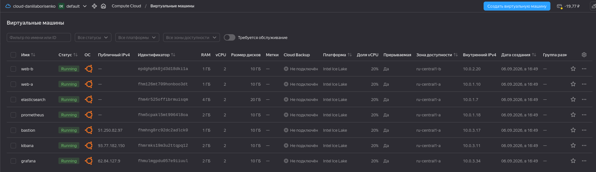

---

# 6. Cloud-init и SSH

При создании ВМ используется `cloud-init.yml`.

На каждой машине создаётся пользователь:

```text
daniil
```

Пользователь получает права `sudo`, а публичный SSH-ключ передаётся в cloud-init из Terraform:

```yaml
#cloud-config

users:
- name: daniil
  groups: sudo
  shell: /bin/bash
  sudo: ["ALL=(ALL) NOPASSWD:ALL"]
  ssh_authorized_keys:
  - ${ssh_public_key}
```

Таким образом публичный ключ не хранится напрямую в конфигурации.

---

# 7. Автоматический Ansible inventory

Одна из важных частей проекта — автоматическая генерация `hosts.ini`.

Раньше IP-адреса серверов приходилось указывать вручную. После пересоздания инфраструктуры адреса менялись, поэтому такой вариант был неудобен.

Для решения этой проблемы добавил:

```text
terraform/hosts.ini.tftpl
terraform/inventory.tf
```

Terraform получает актуальные адреса созданных ВМ и формирует:

```text
ansible/hosts.ini
```

Для сервисных машин используются внутренние IP.

Для bastion используется публичный IP.

Подключение к приватным машинам выполняется через `ProxyCommand` и bastion.

Пользователь Ansible:

```text
daniil
```

После `terraform apply` вручную изменять `hosts.ini` не требуется.

Проверка:

```bash
cd ../ansible
ansible all -m ping
```

Все семь серверов должны вернуть `SUCCESS`.

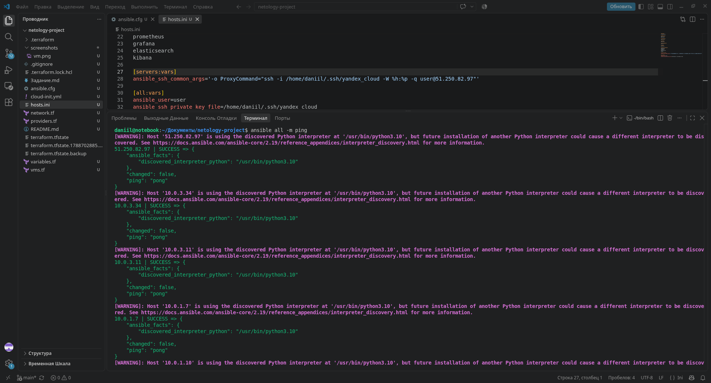

---

# 8. Web-серверы

Для настройки двух web-серверов используется:

```text
nginx_playbook.yml
```

Playbook:

- устанавливает Nginx;
- запускает Nginx;
- включает автоматический запуск;
- создаёт одинаковую статическую страницу на двух серверах.

Запуск:

```bash
ansible-playbook nginx_playbook.yml
```

Проверка:

```bash
ansible webservers -b -m shell -a "systemctl is-active nginx"
```

На обоих серверах Nginx должен находиться в состоянии:

```text
active
```

---

# 9. Балансировка нагрузки

Для сайта через Terraform создаются:

```text
Target Group
Backend Group
HTTP Router
Virtual Host
Application Load Balancer
```

В Target Group находятся обе web-ВМ.

Backend использует HTTP и порт:

```text
80
```

Проверка состояния настроена на:

```text
path: /
port: 80
protocol: HTTP
```

Application Load Balancer принимает внешний HTTP-трафик на порту `80` и распределяет его между двумя web-серверами.

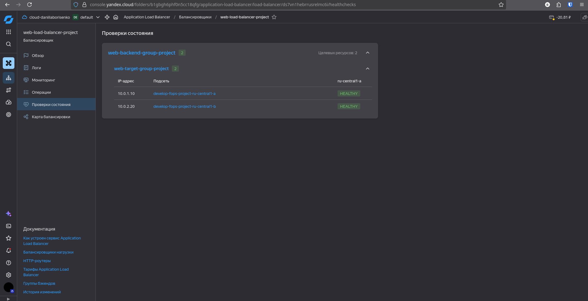

Публичный адрес не прописывается вручную и получается через Terraform:

```bash
terraform output -raw site_ip
```

Проверка:

```bash
curl -v "http://$(terraform output -raw site_ip)"
```

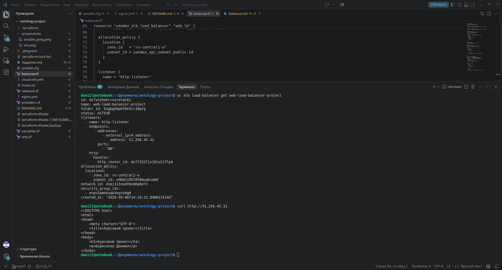


---

# 10. Docker

Prometheus, Grafana, Elasticsearch, Kibana, Filebeat и exporters запускаются в Docker.

Docker и Docker Compose устанавливаются через Ansible.

Основной playbook:

```text
docker_playbook.yml
```

Проверка синтаксиса:

```bash
ansible-playbook docker_playbook.yml --syntax-check
```

Запуск:

```bash
ansible-playbook docker_playbook.yml
```

Playbook устанавливает Docker и автоматически запускает необходимые контейнеры на соответствующих ВМ.

---

# 11. Мониторинг

Для мониторинга используются:

```text
Node Exporter
Nginx Log Exporter
Prometheus
Grafana
```

## Node Exporter

Node Exporter работает на двух web-серверах и предоставляет системные метрики на порту:

```text
9100
```

С его помощью собираются метрики:

- CPU;
- RAM;
- дисков;
- файловой системы;
- сети;
- загрузки системы.

## Nginx Log Exporter

Nginx Log Exporter также работает на обоих web-серверах.

Он читает:

```text
/var/log/nginx/access.log
```

и предоставляет HTTP-метрики на порту:

```text
4040
```

Конфигурация находится в:

```text
nginxlog.hcl
```

На каждом web-сервере Ansible запускает оба exporter:

```bash
docker compose up -d node-exporter nginxlog-exporter
```

---

# 12. Prometheus

Prometheus работает на отдельной приватной ВМ.

Публичного IP у него нет.

Конфигурация находится в:

```text
prometheus.yml
```

Интервал сбора метрик:

```text
15s
```

Адреса web-серверов в конфигурации не прописаны вручную.

Ansible формирует конфигурацию через `hostvars` из актуального inventory:

```yaml
- "{{ hostvars[groups['webservers'][0]].ansible_host }}:9100"
- "{{ hostvars[groups['webservers'][1]].ansible_host }}:9100"
```

Аналогично формируются адреса Nginx Log Exporter на порту `4040`.

Поэтому после пересоздания ВМ конфигурацию Prometheus вручную изменять не требуется.

Проверка готовности:

```bash
ansible prometheus -b -m shell -a "curl -fsS http://localhost:9090/-/ready"
```

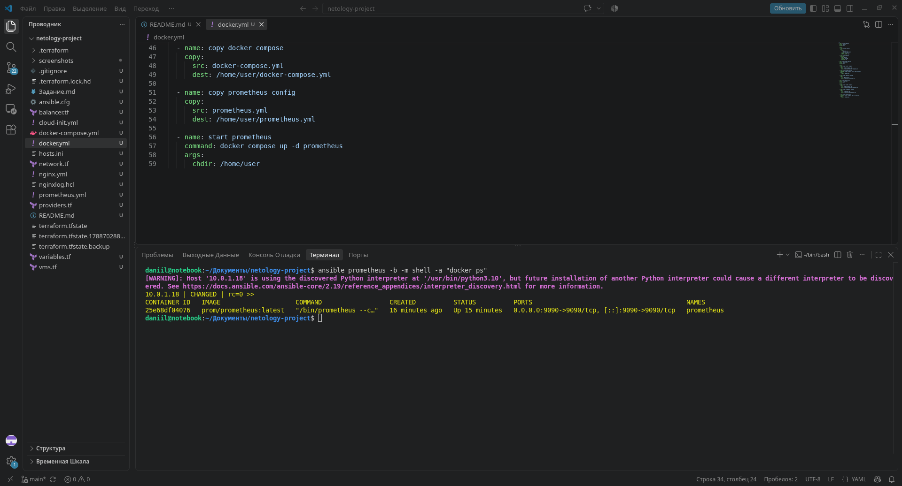

---

# 13. Grafana

Grafana работает на отдельной ВМ и доступна через web-интерфейс на порту:

```text
3000
```

В качестве источника данных используется Prometheus.

Для системных метрик использовал dashboard:

```text
Node Exporter Full
ID: 1860
```

На нём отображаются основные показатели:

- CPU;
- RAM;
- диски;
- сеть;
- загрузка;
- saturation.

На основных графиках настроены thresholds.

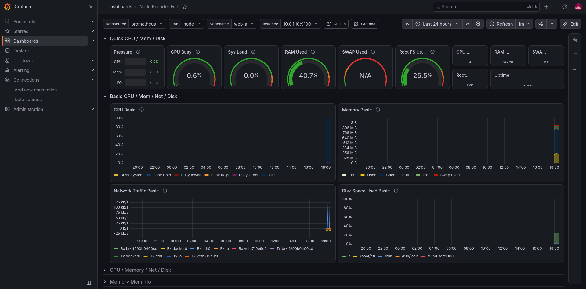

Для метрик Nginx используется dashboard:

```text
NGINX Log Metrics
ID: 15947
```

В том числе отображаются требуемые метрики:

```text
http_response_count_total
http_response_size_bytes
```

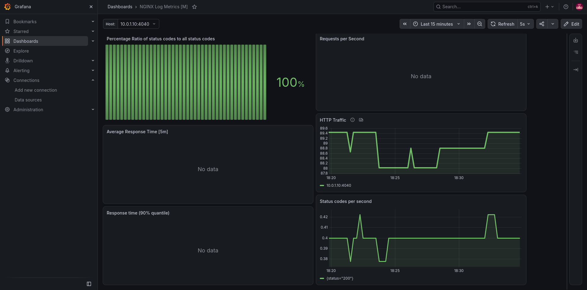

---

# 14. Elasticsearch

Elasticsearch работает на отдельной приватной ВМ.

Используется официальный Docker-образ Elasticsearch `8.15.3`.

Для учебного проекта Elasticsearch работает в режиме:

```text
single-node
```

Через Ansible устанавливается:

```text
vm.max_map_count=262144
```

Также для учебного стенда отключена встроенная авторизация Elasticsearch:

```text
xpack.security.enabled=false
```

Elasticsearch не имеет публичного IP.

Проверка:

```bash
ansible elasticsearch -b -m shell -a "curl -fsS http://localhost:9200"
```

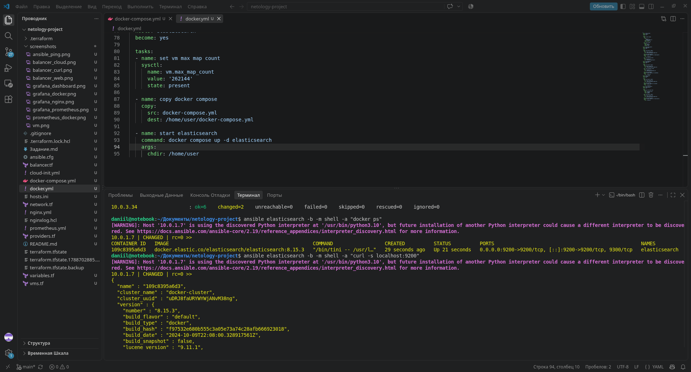

---

# 15. Filebeat

Filebeat работает на обоих web-серверах.

Он читает логи Nginx:

```text
/var/log/nginx/access.log
/var/log/nginx/error.log
```

После этого отправляет их в Elasticsearch.

Адрес Elasticsearch также не прописан статически.

В `filebeat.yml` используется Ansible `hostvars`:

```yaml
output.elasticsearch:
  hosts:
    - "http://{{ hostvars[groups['elasticsearch'][0]].ansible_host }}:9200"
```

Таким образом после изменения IP Elasticsearch конфигурация автоматически получает актуальный адрес.

Проверка контейнеров:

```bash
ansible webservers -b -m shell -a "docker ps | grep filebeat"
```

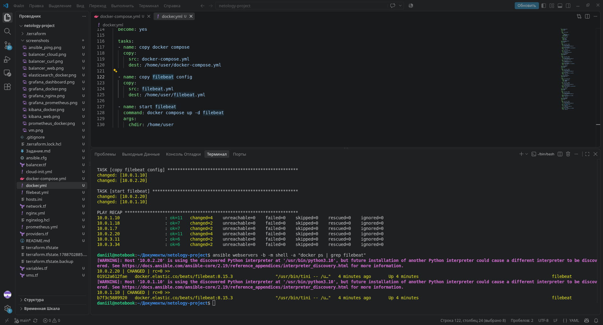

---

# 16. Kibana

Kibana работает на отдельной ВМ.

Web-интерфейс доступен на порту:

```text
5601
```

Kibana подключается к Elasticsearch по его приватному IP.

Адрес Elasticsearch формируется Ansible автоматически через `hostvars` при создании `docker-compose.yml`.

Поэтому после полного пересоздания инфраструктуры IP Elasticsearch вручную изменять не требуется.


---

# 17. Проверка логирования

Для проверки всей цепочки создал несколько запросов к несуществующей странице сайта:

```bash
SITE_IP=$(terraform output -raw site_ip)

for i in {1..10}; do
  curl -s -o /dev/null "http://${SITE_IP}/test404"
done
```

Nginx записывает запросы в `access.log`.

Далее данные проходят по цепочке:

```text
Nginx
  ↓
Filebeat
  ↓
Elasticsearch
  ↓
Kibana
```

В Kibana создан Data View:

```text
filebeat-*
```

В Discover можно найти запросы:

```text
test404
```

В логах отображаются ответы:

```text
GET /test404 HTTP/1.1 404
```

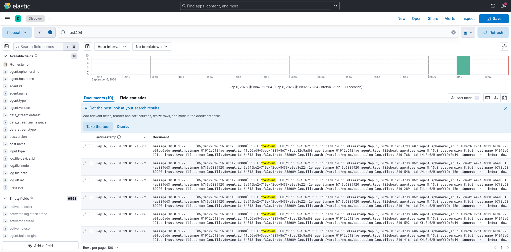

---

# 18. Резервное копирование

Для дисков всех семи виртуальных машин настроено автоматическое создание snapshot.

Расписание:

```text
0 0 * * *
```

Снимок создаётся один раз в сутки.

Срок хранения:

```text
168h
```

То есть семь дней.

В расписание входят диски:

```text
bastion
web-a
web-b
prometheus
grafana
elasticsearch
kibana
```

Проверка:

```bash
yc compute snapshot-schedule list
```

Расписание:

```text
daily-backup-project
```

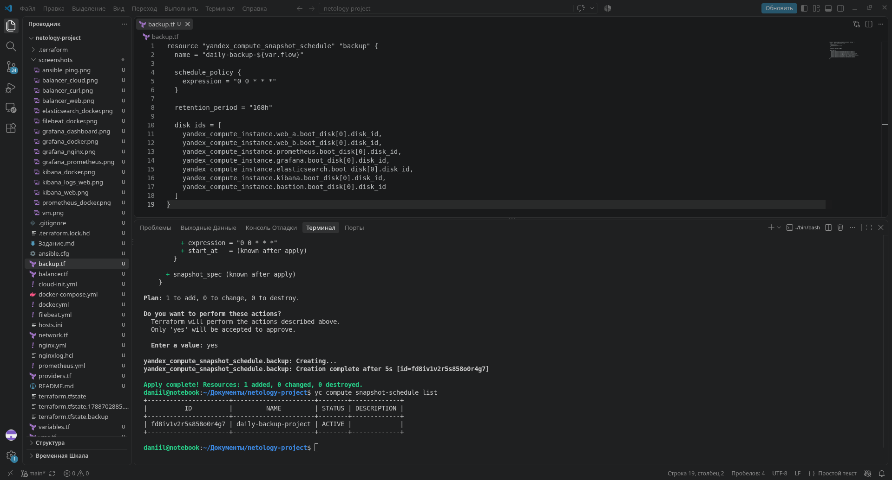

---

# 19. Воспроизводимость инфраструктуры

После основной настройки отдельно проверил возможность полностью пересоздать инфраструктуру.

Главная проблема первоначальной версии заключалась в статически указанных IP-адресах.

При выполнении:

```bash
terraform destroy
terraform apply
```

виртуальные машины получают новые адреса, поэтому ручная конфигурация нарушала воспроизводимость проекта.

Это было исправлено.

Сейчас:

- Ansible inventory генерируется Terraform автоматически;
- публичный SSH-ключ передаётся через переменную Terraform;
- SSH-пользователь `daniil` создаётся через cloud-init;
- Prometheus получает адреса web-серверов через Ansible `hostvars`;
- Filebeat получает адрес Elasticsearch через `hostvars`;
- Kibana получает адрес Elasticsearch через `hostvars`;
- ручное изменение IP после `terraform apply` не требуется.

Для проверки выполнил полный цикл удаления и повторного создания инфраструктуры.

После пересоздания все ВМ получили актуальные адреса, inventory был создан автоматически, а Ansible успешно подключился ко всем машинам.

---

# 20. Полное развёртывание с нуля

## Terraform

Перехожу в каталог:

```bash
cd terraform
```

Передаю SSH-ключ:

```bash
export TF_VAR_ssh_public_key="$(cat ~/.ssh/yandex_cloud.pub)"
```

Получаю токен Yandex Cloud:

```bash
export YC_TOKEN=$(yc iam create-token --impersonate-service-account-id <SERVICE_ACCOUNT_ID>)
export YC_CLOUD_ID=$(yc config get cloud-id)
export YC_FOLDER_ID=$(yc config get folder-id)
```

После этого:

```bash
terraform init
terraform validate
terraform plan
terraform apply
terraform output
```

После `terraform apply` автоматически создаётся:

```text
../ansible/hosts.ini
```

Редактировать его вручную не требуется.

## Ansible

Перехожу в каталог:

```bash
cd ../ansible
```

Проверяю подключение:

```bash
ansible all -m ping
```

Проверяю playbook:

```bash
ansible-playbook nginx_playbook.yml --syntax-check
ansible-playbook docker_playbook.yml --syntax-check
```

Разворачиваю Nginx:

```bash
ansible-playbook nginx_playbook.yml
```

Разворачиваю Docker-сервисы:

```bash
ansible-playbook docker_playbook.yml
```

После этих команд серверная часть инфраструктуры поднимается без ручного изменения IP-адресов.

---

# 21. Проверка сервисов

Nginx:

```bash
ansible webservers -b -m shell -a "systemctl is-active nginx"
```

Контейнеры на web-серверах:

```bash
ansible webservers -b -m shell -a "docker ps"
```

Prometheus:

```bash
ansible prometheus -b -m shell -a "curl -fsS http://localhost:9090/-/ready"
```

Grafana:

```bash
ansible grafana -b -m shell -a "curl -fsS http://localhost:3000/api/health"
```

Elasticsearch:

```bash
ansible elasticsearch -b -m shell -a "curl -fsS http://localhost:9200"
```

Kibana:

```bash
ansible kibana -b -m shell -a "curl -s http://localhost:5601/api/status | head -c 500"
```

---

# 22. Доступ к сервисам

Актуальные адреса получаю через Terraform:

```bash
cd terraform
terraform output
```

Адрес сайта:

```bash
terraform output -raw site_ip
```

Адрес Grafana:

```bash
terraform output -raw grafana_ip
```

Адрес Kibana:

```bash
terraform output -raw kibana_ip
```

Проверить сайт:

```bash
curl "http://$(terraform output -raw site_ip)"
```

Grafana:

```text
http://<grafana_ip>:3000
```

Kibana:

```text
http://<kibana_ip>:5601
```

Prometheus и Elasticsearch находятся в приватной сети и напрямую из интернета недоступны.

---

# Итог

В результате в Yandex Cloud развернул инфраструктуру с двумя Nginx web-серверами в разных зонах доступности.

Внешний HTTP-трафик проходит через Application Load Balancer и распределяется между двумя backend-серверами.

Для мониторинга используются Prometheus, Node Exporter, Nginx Log Exporter и Grafana.

Для сбора логов используется цепочка:

```text
Nginx -> Filebeat -> Elasticsearch -> Kibana
```

Доступ к серверам по SSH выполняется пользователем `daniil`. Для сервисных машин подключение проходит через bastion.

Доступ между компонентами ограничен Security Groups.

Для дисков всех виртуальных машин настроено ежедневное резервное копирование со сроком хранения семь дней.

Инфраструктура создаётся Terraform, конфигурация серверов выполняется Ansible.

Отдельно проверил полное пересоздание инфраструктуры. После `terraform destroy` и нового `terraform apply` актуальный Ansible inventory формируется автоматически, а конфигурации сервисов получают новые внутренние IP без ручного редактирования файлов.

Это позволяет развернуть серверную часть проекта с нуля последовательным запуском Terraform и двух Ansible playbook.